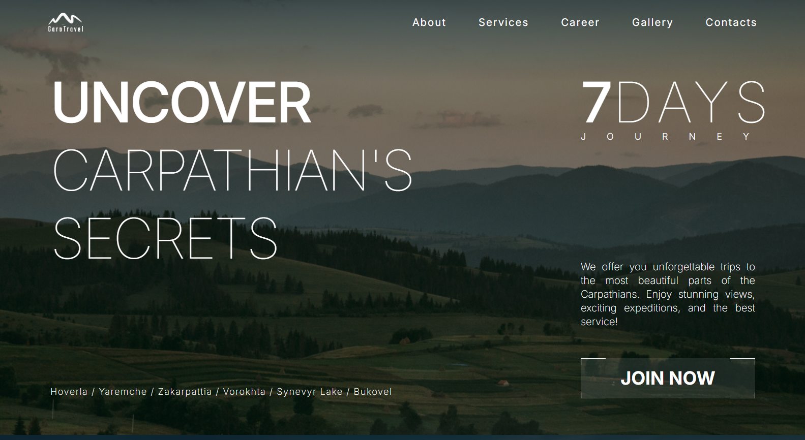

# Carp Travel

[Live Page](https://carp-travel-red.vercel.app/)

## Features
- **Responsive Design** built with Tailwind CSS to provide a great user experience across devices.
- **Interactive Forms** using `react-hook-form` for seamless user input and validation.
- **Activity Showcase** with exciting visuals for adventures like ATV traveling, rock climbing, hot air ballooning, skydiving, and rafting.
- **Photo Gallery** for showcasing stunning Carpathian landscapes.
- **Contact Section** for inquiries and communication, including a team application form.
- **Social Media Integration** with links to platforms like Facebook, Instagram, YouTube, and TikTok.

## Technologies Used

- Next.js
- Tailwind CSS
- React Hook Form
- React responsive
- Swiper
- Yup

